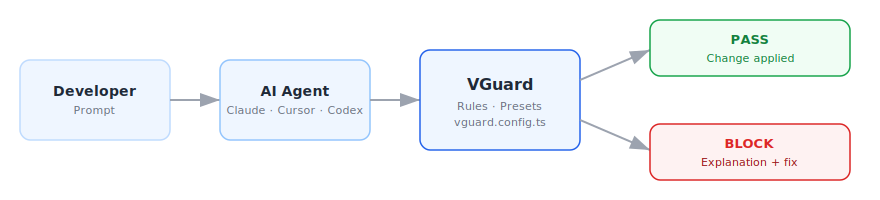
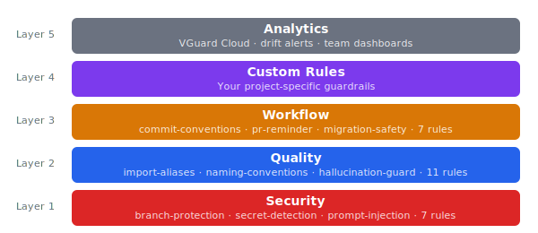
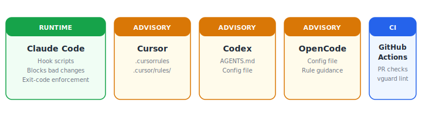

<div align="center">

# VGuard

**AI coding guardrails that actually enforce.**

[](https://www.npmjs.com/package/@anthril/vguard)
[](https://www.npmjs.com/package/@anthril/vguard)
[](LICENSE)
[](https://github.com/anthril/vibe-guard/actions)
[](package.json)

</div>

---

AI coding tools write code fast, but they also introduce security vulnerabilities, break project conventions, and push to protected branches. VGuard sits between the AI tool and your codebase, checking every proposed change before it happens. Bad changes get blocked with a clear explanation and a suggested fix. Good changes pass through without friction.



## Quick Start

```bash
npm install -D @anthril/vguard
npx vguard init
```

Answer four questions and you have working guardrails. The init wizard detects your framework, asks which AI tools you use, and generates everything. See the full [Getting Started](https://vguard.dev/docs/getting-started) guide.

## Features

**Runtime Enforcement** — Claude Code hooks run before every tool call. VGuard inspects the proposed change, evaluates it against your rules, and blocks anything that violates them. The AI agent sees exactly what went wrong and how to fix it. [Adapter docs →](https://vguard.dev/docs/adapters/claude-code)

**Advisory Guidance** — Cursor, Codex, and OpenCode don't support runtime hooks, so VGuard generates configuration files that teach the AI your project's rules before it starts writing. [Agent setup →](https://vguard.dev/docs/agent-setup)

**Smart Detection** — Edit rules only flag problems that are newly introduced. Pre-existing issues in the file are left alone so you can adopt guardrails incrementally without fixing every legacy violation first. [Rules overview →](https://vguard.dev/docs/rules/overview)

## Rule Layers



### Rules — 25 built-in

| Category     | Count | Examples                                                              | Docs                                                     |
| ------------ | ----: | --------------------------------------------------------------------- | -------------------------------------------------------- |
| **Security** |     7 | branch-protection, secret-detection, prompt-injection, rls-required   | [security rules](https://vguard.dev/docs/rules/security) |
| **Quality**  |    11 | import-aliases, naming-conventions, hallucination-guard, dead-exports | [quality rules](https://vguard.dev/docs/rules/quality)   |
| **Workflow** |     7 | commit-conventions, pr-reminder, migration-safety, changelog-reminder | [workflow rules](https://vguard.dev/docs/rules/workflow) |

### Presets — 14 ecosystem presets

nextjs-15 · react-19 · typescript-strict · supabase · tailwind · django · fastapi · laravel · wordpress · react-native · astro · sveltekit · python-strict · go

[Browse all presets →](https://vguard.dev/docs/presets)

### Agent Support



## Documentation

| Section                                                     | Description                                   |
| ----------------------------------------------------------- | --------------------------------------------- |
| [Getting Started](https://vguard.dev/docs/getting-started)  | Install, init wizard, first run               |
| [Configuration](https://vguard.dev/docs/configuration)      | `vguard.config.ts` reference                  |
| [CLI](https://vguard.dev/docs/cli)                          | `init`, `add`, `remove`, `generate`, `doctor` |
| [Rules](https://vguard.dev/docs/rules/overview)             | All built-in rules with examples              |
| [Presets](https://vguard.dev/docs/presets)                  | Framework-specific rule bundles               |
| [Agent Setup](https://vguard.dev/docs/agent-setup)          | Per-agent adapter configuration               |
| [Custom Rules](https://vguard.dev/docs/guides/custom-rules) | Write your own guardrails                     |
| [Troubleshooting](https://vguard.dev/docs/troubleshooting)  | Common issues and fixes                       |

## VGuard Cloud

[VGuard Cloud](https://vguard.dev) gives your team a dashboard for AI coding activity — which rules fire most, who's triggering blocks, and how conventions drift over time. Set up drift alerts, connect webhooks, and export analytics. Free tier available for small teams.

[Cloud docs →](https://vguard.dev/docs/cloud-integration) · [Sign up →](https://vguard.dev)

## Sponsors

This project is maintained by [Anthril](https://github.com/anthril) and funded by our sponsors.

[Become a sponsor →](https://github.com/sponsors/anthril)

### Featured Sponsors

<!-- readme-sponsors-featured --><!-- readme-sponsors-featured -->

### All Sponsors

<!-- readme-sponsors-all --><!-- readme-sponsors-all -->

## Community

- [GitHub Discussions](https://github.com/anthril/vibe-guard/discussions)
- [Contributing](CONTRIBUTING.md)
- [Code of Conduct](CODE_OF_CONDUCT.md)
- [Security Policy](SECURITY.md)
- [Changelog](CHANGELOG.md)

## License

[Apache 2.0](LICENSE) — Anthril
